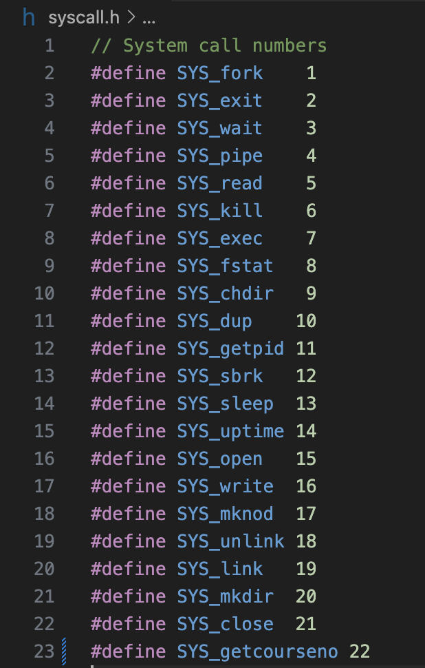
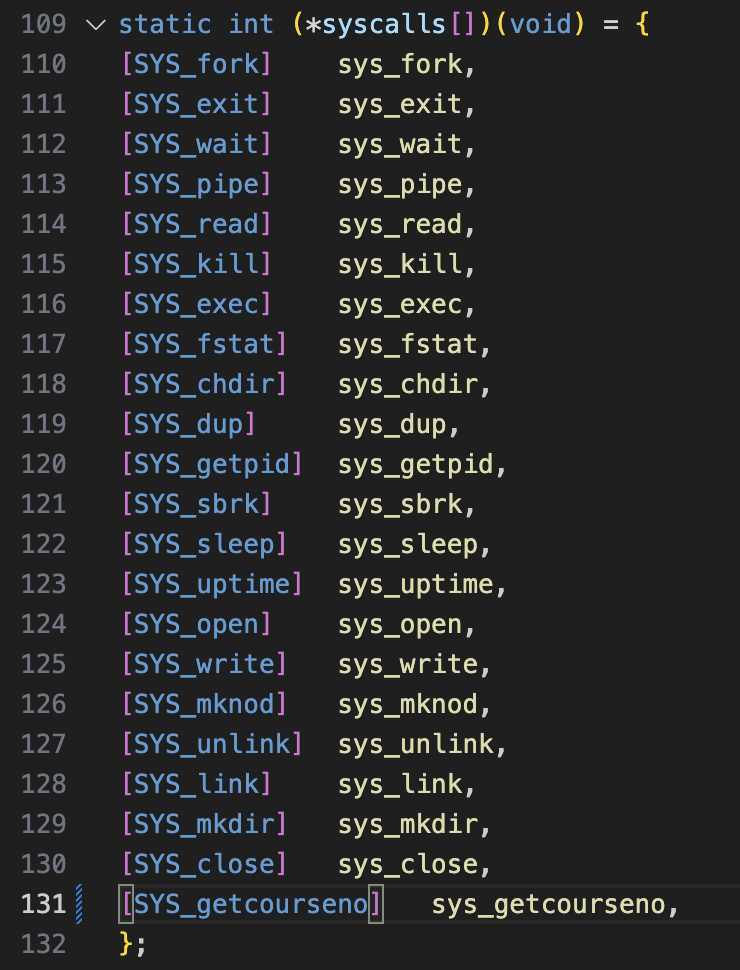
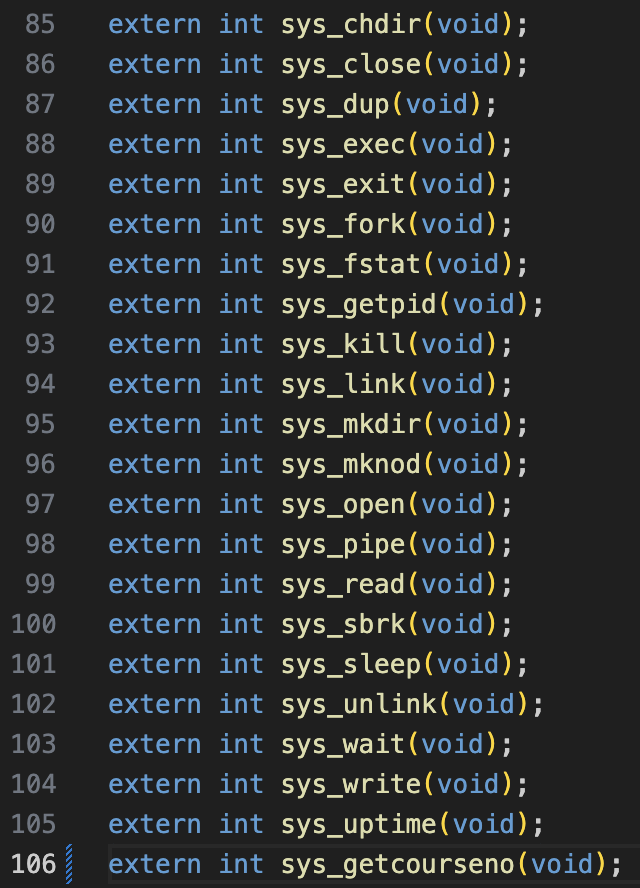
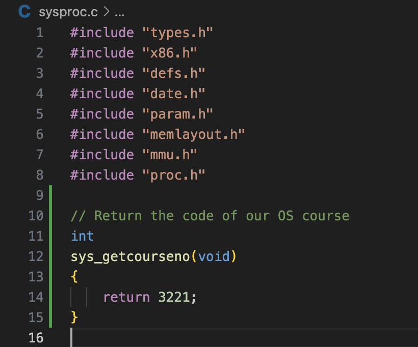
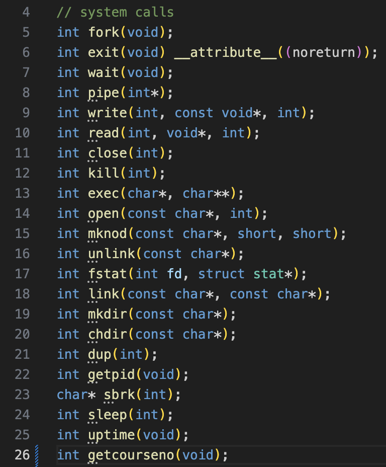
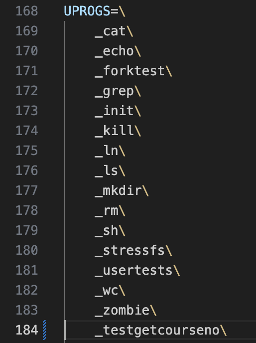
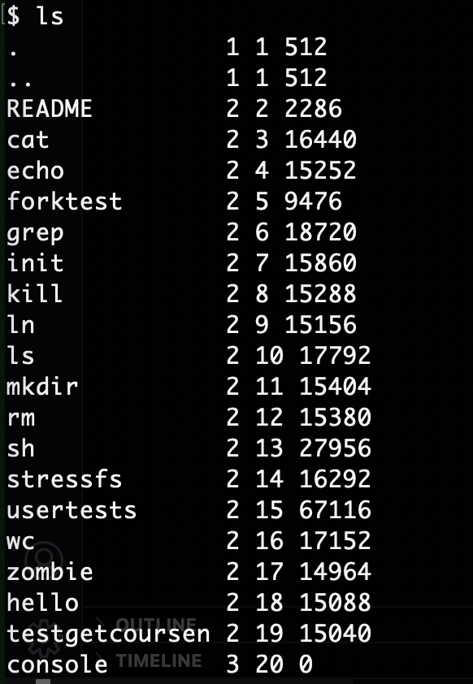

# Kernel Programming by Adding a System Call in xv6

A comprehensive guide to adding custom system calls in the xv6 operating system.

## Overview

This guide demonstrates how to implement a custom system call called `getcourse`, which returns 3221 from the kernel (the number for our OS course). 
Adding a new system call in xv6 requires modifying five key files in the operating system.

## Prerequisites

- [Set up xv6](https://github.com/hamzehkhazaei/EECS3221_Xv6-Setup) 

## Files to Modify

To add a new system call in xv6, you need to modify the following files:

1. `syscall.h` - System call number definitions
2. `syscall.c` - System call dispatch table
3. `sysproc.c` - System call implementation
4. `usys.pl` - User-space system call stubs
5. `user.h` - User-space function declarations

## Step-by-Step Implementation

### Step 1: Define System Call Number

Open `syscall.h` and add a new system call number. Since there are 21 existing system calls, we'll use number 22:

```c
#define SYS_getcourseno 22
```



### Step 2: Add Function Pointer to Dispatch Table

In `syscall.c`, add the function pointer to the system call dispatch table:

```c
[SYS_getcourseno] sys_getcourseno,
```



Also, add the function prototype in the same file:

```c
extern int sys_getcourseno(void);
```


### Step 3: Implement the System Call Function

Open `sysproc.c` and add the implementation of your system call:

```c
// Return the code of our OS course
uint64
sys_getcourseno(void)
{
    return 3221;
}
```



### Step 4: Add User-Space Assembly Stub

In `usys.pl`, add the entry `entry("getcourseno");` for the new user program:

```
...
entry("sleep");
entry("uptime");
entry("getcourseno");
```

This Perl file generates the assembly stub that will be called from user programs

### Step 5: Add User-Space Function Declaration

In `user.h`, add the function declaration that user programs will use:

```c
int getcourseno(void);
```


## Testing the System Call

Create a test user program to verify that your system call works correctly:

```c
#include "kernel/types.h"
#include "kernel/stat.h"
#include "user.h"

int main(void)
{
    printf("Note: The OS course number at York University is: %d\n", getcourseno());
    exit(0);
}
```

### Adding the Test Program

To include your test program in xv6:

1. Save the test program as `getcourseno.c` in the xv6 directory
2. Add `_getcourseno\` to the `UPROGS` section in the `Makefile`

3. Recompile and run xv6 as follows.

## Building and Running

1. Compile and Run xv6:
   ```bash
   make qemu
   ```
2. In the xv6 shell, run `ls` to see the list of availabe programs; you should see your test program in there:
   

3. In the xv6 shell, run your test program:
   ```bash
   $ getcourseno
   ```

Expected output:
   ```bash
   Note: The OS course number at York University is: 3221
   ```

## Understanding the Process

### System Call Flow

1. **User Program Call**: User program calls `getcourseno()`
2. **Assembly Stub**: `usys.S` that dynamically will be generated by `usys.pl` stub puts system call number in register
3. **Kernel Trap**: CPU traps to kernel mode
4. **Dispatch**: `syscall()` function looks up system call number 22
5. **Execution**: `sys_getcourseno()` function executes and returns the course number
6. **Return**: Value is returned to the user program

### Key Concepts

- **System Call Numbers**: Each system call has a unique number used for dispatch
- **Function Pointers**: The kernel uses a table of function pointers for efficient dispatch
- **User/Kernel Interface**: Assembly stubs bridge user-space and kernel-space
- **Return Values**: System calls can return integer values to user programs

## Common Pitfalls

- **Forgetting to update all 5 files**: Missing any file will cause compilation errors
- **Incorrect system call numbers**: Using duplicate numbers will cause conflicts
- **Missing function prototypes**: Forgetting `extern` declarations in `syscall.c`

## Debugging Tips

1. **Use `make qemu-gdb`** for GDB debugging
2. **Check compilation errors** carefully - they usually point to missing modifications
3. **Verify system call numbers** are unique and consistent across files
4. **Test incrementally** - add print statements to verify execution flow

## Additional Resources

- [xv6 Book](https://github.com/hamzehkhazaei/xv6-riscv-book/blob/xv6-riscv/book.pdf) - Comprehensive guide to xv6
- [MIT 6.828 Course](https://pdos.csail.mit.edu/6.828/) - Operating systems engineering course
- [xv6 Source Code](https://github.com/hamzehkhazaei/xv6-riscv) - Official xv6 repository

## Conclusion

Adding system calls to xv6 is a fundamental exercise in understanding the internals of an operating system. 
The process involves creating bridges between user-space applications and kernel functionality, demonstrating the layered architecture of modern operating systems.

This implementation provides a foundation for more complex system calls that can interact with process management, file systems, and hardware resources.

**Instructor:** Hamzeh Khazaei
